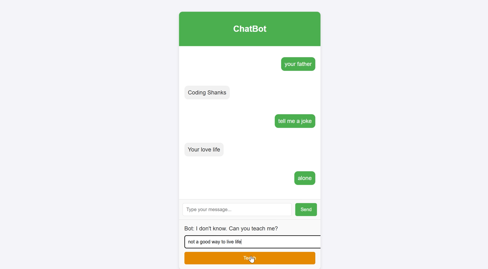

# 🚀 Flask ChatBot  

A **modern AI-powered chatbot** built with Flask for the backend and HTML/CSS/JavaScript for the frontend. This chatbot can respond to user queries and even **learn new responses** dynamically. A perfect project for beginners and developers looking to build a web-based chatbot!  


## ✨ Features  
✅ **Real-Time Chat:** Users can communicate with the chatbot seamlessly.  
✅ **Teach the Bot:** If the bot doesn’t recognize a question, users can teach it a new response.  
✅ **JSON Knowledge Base:** Stores all questions and answers in `knowledge_base.json`.  
✅ **Responsive Design:** Fully optimized for all screen sizes.  
✅ **Lightweight & Fast:** Built with Flask, ensuring quick response times.  

---

## 🛠 Technologies Used  
- **Backend:** Flask (Python)  
- **Frontend:** HTML, CSS, JavaScript  
- **Data Storage:** JSON file (`knowledge_base.json`)  

---

## 📸 Screenshots  


---

## ⚙️ Installation & Setup  

Follow these steps to run the chatbot on your local machine.  

### 1⃣ Clone the Repository  
```bash
git clone https://github.com/Coding-Shanks/flask-chatbot.git
cd flask-chatbot
```

### 2⃣ Set Up a Virtual Environment *(Optional but Recommended)*  
```bash
python -m venv venv
source venv/bin/activate  # On Windows: venv\Scripts\activate
```

### 3⃣ Install Dependencies  
```bash
pip install flask
```

### 4⃣ Run the Flask Application  
```bash
python app.py
```

### 5⃣ Open in Browser  
Go to **[http://127.0.0.1:5000](http://127.0.0.1:5000)** to start chatting with your bot!  

---

## 👤 Project Structure  
```
flask-chatbot/
│
├── app.py                  # Flask backend
├── templates/              # HTML templates
│   └── index.html          # Main chatbot interface
├── static/                 # Static files (CSS, JS)
│   ├── styles.css          # Custom CSS for styling
│   └── script.js           # JavaScript for interactivity
└── knowledge_base.json     # Knowledge base file
```

---

## 🚀 How It Works  
1⃣ The user enters a message in the chatbox and clicks **Send**.  
2⃣ The chatbot processes the input and searches for a response in `knowledge_base.json`.  
3⃣ If a matching response is found, the bot replies instantly.  
4⃣ If the bot doesn't recognize the query, it prompts the user to **teach it a response**.  
5⃣ The user enters the correct response, which gets stored in `knowledge_base.json` for future reference.  

---

## 🎨 Customization  
🛠 **Add More Questions:** Manually edit `knowledge_base.json` to include more Q&A pairs.  
🎨 **Change Styling:** Modify `static/styles.css` to redesign the chatbot UI.  
🌍 **Deploy Online:** Use **Heroku, Render, or PythonAnywhere** for online hosting.  

---

## 🤝 Contributing  
We welcome contributions! Follow these steps to contribute:  

1. **Fork the repository.**  
2. Create a new branch:  
   ```bash
   git checkout -b feature/YourFeatureName
   ```
3. Make your changes and commit:  
   ```bash
   git commit -m "Added a new feature"
   ```
4. Push to your branch:  
   ```bash
   git push origin feature/YourFeatureName
   ```
5. Open a **pull request** for review. 🎉 

---

## 📚 License  
📝 This project is licensed under the **MIT License**. See the [LICENSE](LICENSE) file for details.  

---

## 👨‍💻 Author  
👉 **Coding-Shanks**  

💻 **GitHub:** [github.com/Coding-Shanks](https://github.com/Coding-Shanks)  

---

## ⭐ Support  
If you find this project useful, consider giving it a **⭐ on GitHub**!  

---

## 🏆 Acknowledgments  
📌 **Flask Documentation:** [Flask Official Docs](https://flask.palletsprojects.com/)  
📌 **JavaScript Fetch API:** [MDN Docs](https://developer.mozilla.org/en-US/docs/Web/API/Fetch_API)  
📌 Inspired by various chatbot tutorials and AI projects.  

---

## 🚀 Ready to Build & Deploy?  
Start coding today and take this chatbot to the next level! 🔥  

---
